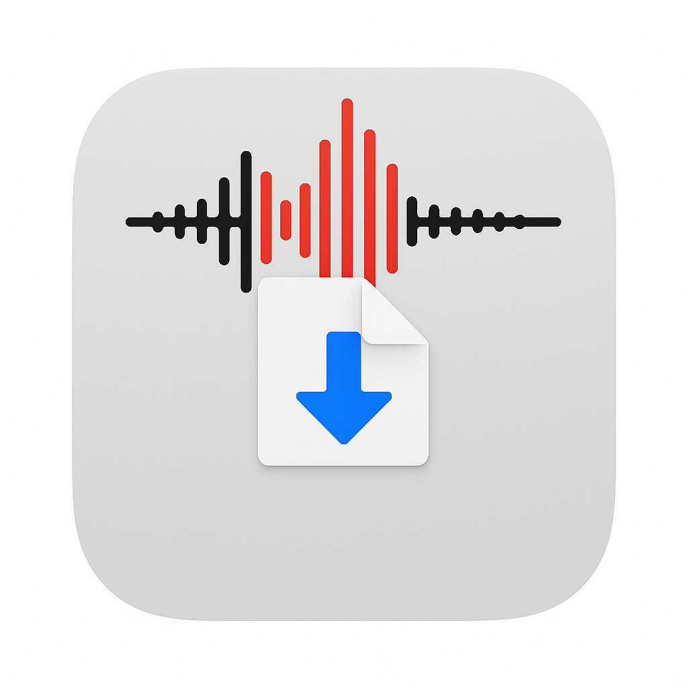

# Voice Memos Exporter

  

A simple Mac app that lets you bulk export Voice Memos from the Mac app all at once. Stop exporting recordings one by one - just select and export them all together.

  

## What It Does

- Export multiple voice memos at once, export your entire voice memos to disk
- Search through your recordings
- Works offline, no data collection
- Will transfer all your iPhone voice memos too, if they are synced via iCloud

## Installation

1. Download newest Release
2. Move it to your Applications folder
3. Open the app
4. Allow Full Disk Access when asked (needed to read Voice Memos)

## How to Use

1. Open the app
2. Select the recordings you want to export
3. Click "Export Selected"
4. Choose where to save them
5. Done!

## Requirements

- macOS 10.15 or newer
- Full Disk Access permission (for Voice Memos access)

## Common Questions

**Q: Why do you need Full Disk Access?**
A: macOS requires this permission to read Voice Memos. Without it, no app can access your recordings.

**Q: Is my data safe?**
A: Yes! The app works completely offline. It just reads your Voice Memos and copies the ones you select.

**Q: What if I have files with the same name?**
A: The app automatically adds numbers to avoid overwriting files.

Made by Rudra Kabir